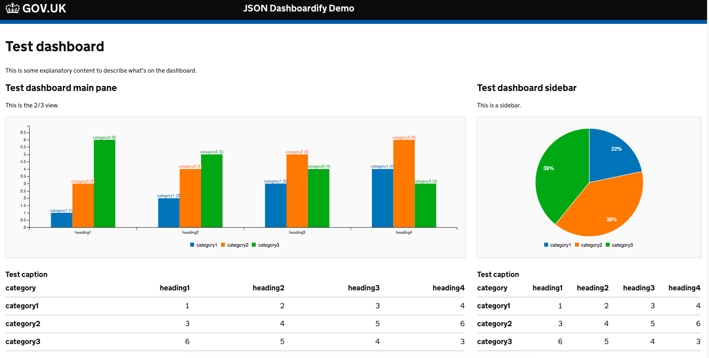

# vuejs-json-dashboardify
Create a client-side VueJS component which reads JSON from a GET endpoint and renders into the GovUK Frontend template dynamically including containers, grid rows headers, content and tables. This is to be used to render dynamic content from a static S3-backed server.


## Setup

You can run locally in docker as follows:

```
docker-compose build
docker-compose run --service-ports demo bash -c "npm run server"
# The demo page should be available on http://localhost:8000
```

Alternatively you can run locally without docker  
`npm install` and then
`gulp` to load the govuk-frontend and build the css.

Then you can run the code with an npm http server
`http-server . -a 127.0.0.1 -p 8000`

# End-to-end tests

I've made a start on some end-to-end tests using nightwatch.

You can run the tests as follows:

```
docker-compose run demo bash -c "npm run server & npm run e2e"
```

## Invoke the component

Once you've got all the scripts loading correctly you can
use the component by just including something like this
in your page.

You can see the HTML elements supported in the example file
[example.json](example.json). The only restriction is that
the top level component in the JSON has to be a div of some
sort.

```HTML
<json-dashboardify-url-element
    group="unique-within-page"
    source="/example.json">
</json-dashboardify-url-element>
```

## TODO
This is all a bit clumsy at the moment.

I think the next steps are to turn the pe-charts table-chart
into a proper VueJS component so it can be included inline.
